# Look board 1: your game, in other framings

Every picture is **your current build**, rendered by Godot 4.7.2 from the `studio` branch. Same place, same character, same world. Only the camera changes. The player stands on the path south of the village, at (2, 44). The camera faces north, as it always does.

**In one line** `[run]`: your world already holds a vista (the watchtower, the path winding north, the windmill, the pond). Today's camera, and your fog, hide it. A low camera shows it, and even the 2019 Galaxy S10 holds 30 fps doing so.

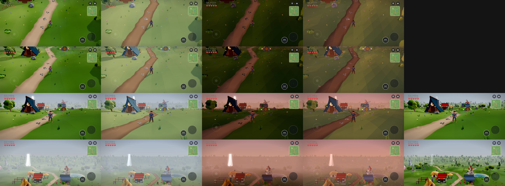

*Rows, top to bottom: BUILD (today's camera), FIGHT, EXPLORE, VANTAGE. Columns: Compatibility by day, Mobile by day, Compatibility at dusk, Mobile at dusk, and Compatibility with the fog pushed out (EXPLORE and VANTAGE only).*

## 1. The framings

| Framing | Camera | Compatibility, day | Mobile, day | Compatibility, dusk |
|---|---|---|---|---|
| **BUILD**, today's camera | -45°, 18 m, field of view 32° | 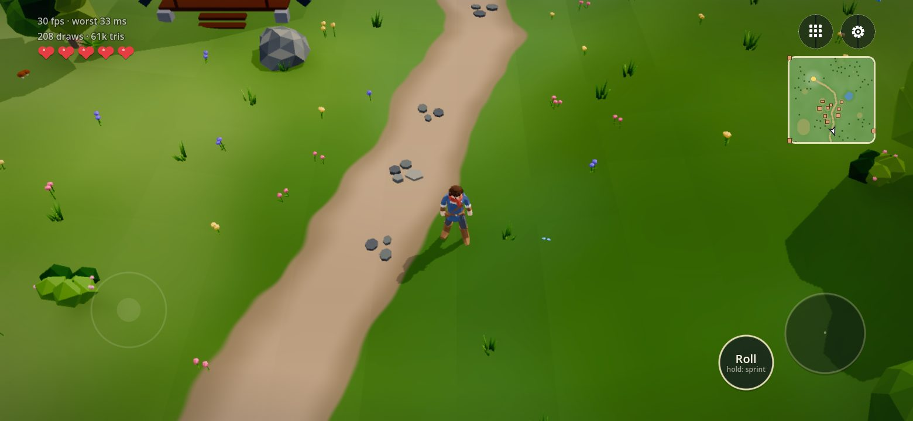 | 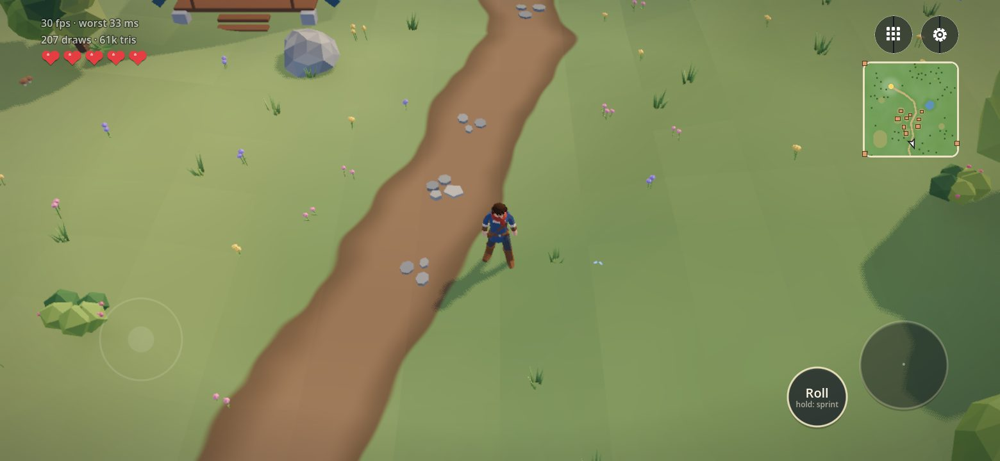 | 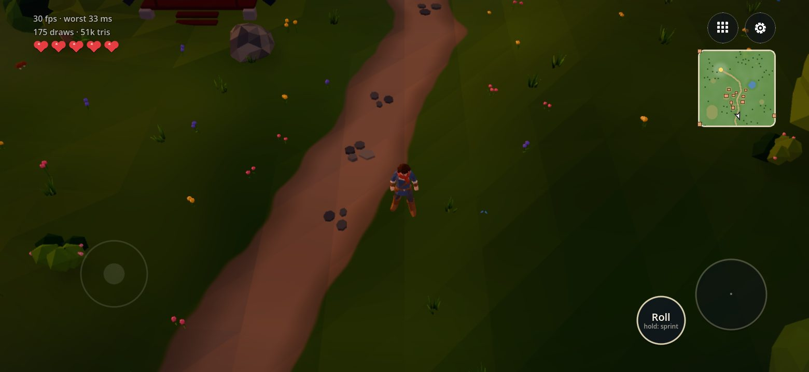 |
| **FIGHT** | -32°, 12 m, 45° | 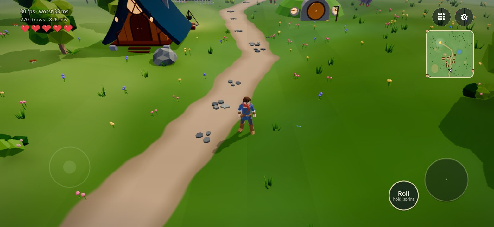 | 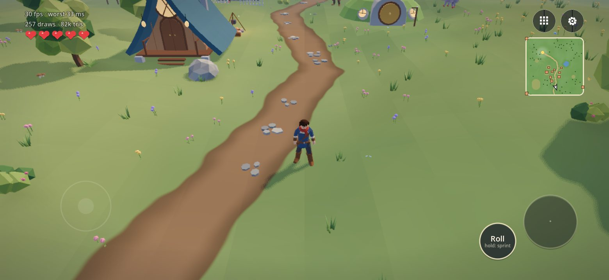 | 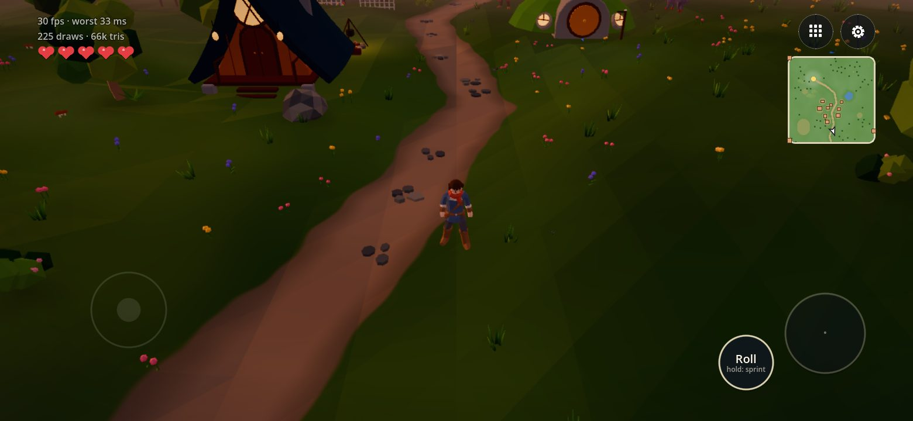 |
| **EXPLORE** | -10°, 8 m, 50° | 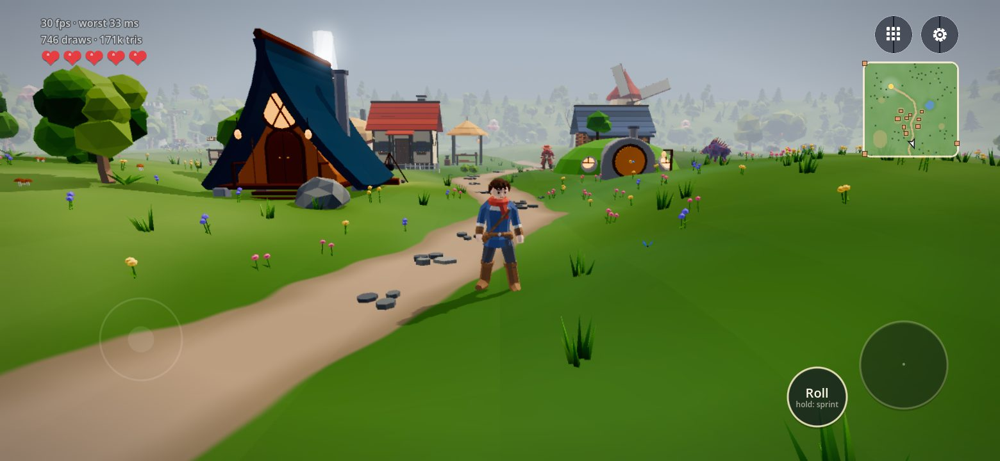 | 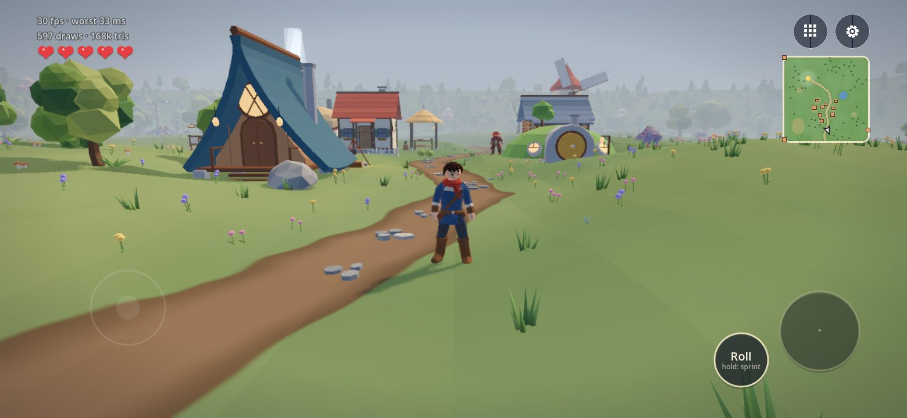 | 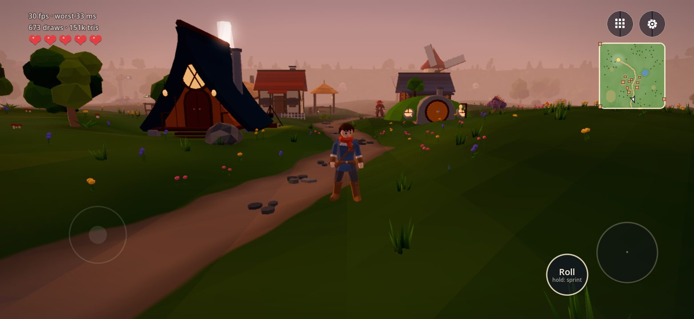 |
| **VANTAGE** (as if from a tower) | -5°, 6 m, 40°, 14 m up | 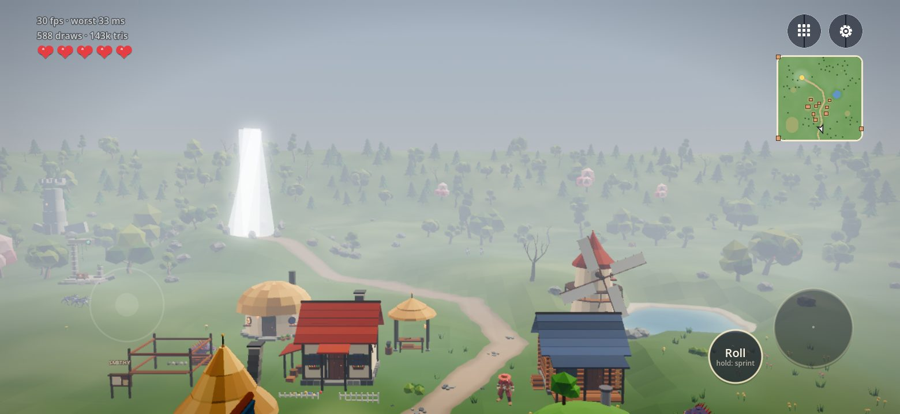 | 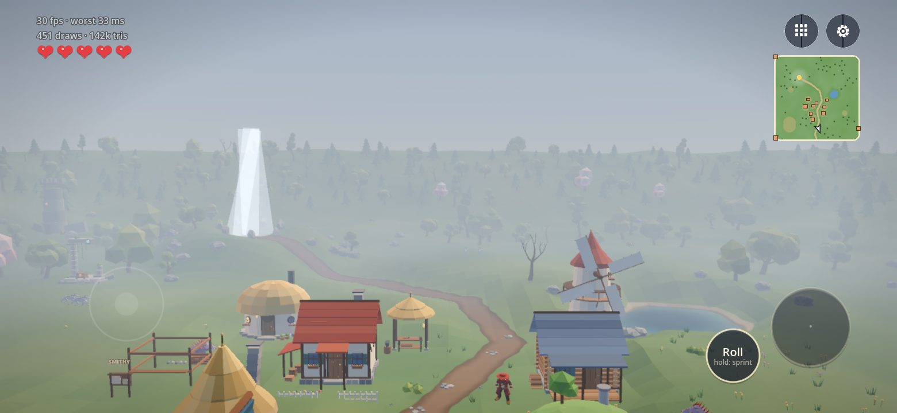 | 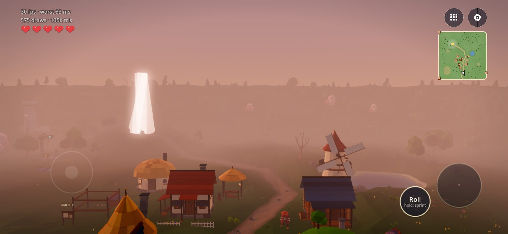 |

**The fog pushed out** from 22-95 m to 60-300 m:

| EXPLORE | VANTAGE |
|---|---|
| 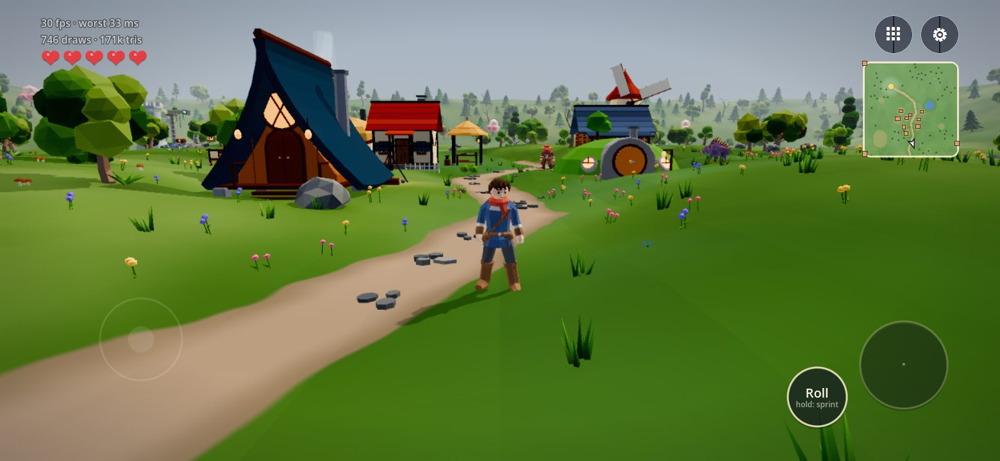 | 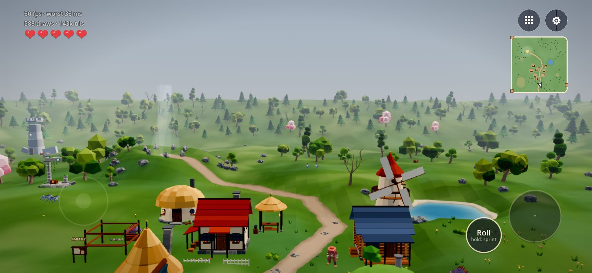 |

The full-size files are in `evidence/lookboard-1/`. The Mobile renderer at dusk is there too.

## 2. What the pictures show `[run]`

1. **BUILD and FIGHT never show the sky.** The village is right beside you (the minimap shows it), but BUILD shows only path and grass.
2. **EXPLORE turns the same spot into a place.** You see the sky, the village skyline, the windmill, and your character large enough to read the outfit.
3. **Your fog is tuned for the high camera.** It begins at 22 m and is total by 95 m. From a tower (VANTAGE), that becomes a wall of haze. Pushed to 60-300 m, it uncovers the whole meadow: the Old Watchtower, the path north, the windmill, the pond, the forest line.
4. **The land ends in a hard line against a flat grey sky.** Nothing stands behind it: no mountains, no other land. A horizon camera needs backdrops: distant ridges, the strait, the veiled third land (`CAMERA-AND-FORMAT.md` section 5).
5. **The Mobile renderer looks paler and flatter in every frame.** Your lighting is tuned for Compatibility. Mobile can't be judged fairly until the lighting gets a pass for it, so **this board doesn't decide the renderer**.

## 3. What it costs on the weakest phone `[run]`

**Standing still** (Galaxy S10, native Android, Compatibility; your on-screen counter after 90 s):

| Framing | fps | worst frame | draw calls | triangles |
|---|---|---|---|---|
| BUILD (today) | 30 | 33 ms | 270 | 81k |
| VANTAGE, your fog | 30 | 33 ms | 405 | 107k |
| VANTAGE, fog pushed out | 30 | 34 ms | 415 | 107k |
| EXPLORE | 30 | 33 ms | 629 | 150k |

The S10 pictures (`evidence/lookboard-1/s10/`) stand a little further north than the PC ones. The start position landed differently on the phone. Same village, same framings.

**Turning the camera, as a player dragging it would** (a full turn twice at 90° a second, every frame timed; `evidence/lookboard-1/s10/turntable-*.txt`):

| S10 launch | first turn: frames over 50 ms | second turn | worst frame |
|---|---|---|---|
| fresh install, data wiped | 3 (138-235 ms) | 1 (152 ms) | 235 ms |
| next launch | 1 (149 ms) | 6 (79-137 ms) | 149 ms |
| the launch after | 0 | 0 | 42 ms |
| reinstalled, data kept | 0 | 0 | 40 ms |

**Reading:**
- **Turning costs little once warmed up.** The median frame stays at the 30 fps lock, and the worst frame is about 40 ms.
- **Early launches stutter** the first time something new comes into view. That fits shaders compiling on first sight: they fade as Godot's shader cache fills.
  - The fix is standard: warm every shader behind the first loading screen.
  - Godot's Mobile renderer has built-in help for this (ubershaders, and a shader baker at export). Compatibility doesn't.
- **One launch stuttered in directions it had already seen.** So not everything is shaders, and this needs a trace before we name a cause.

**Correction (29 Sep, later the same night)** `[run]`. After seven more S10 launches, the reading above is only partly right.
- **Stutters while turning aren't only first-launch.** 3 launches were clean. 4 had 1-7 frames over 50 ms (worst 242 ms), including relaunches and directions already seen. The shader cache helps, but it doesn't explain all of them.
- **What the per-frame breakdown rules out:**
  - your see-through tree fade: no tree was fading at almost any slow frame;
  - mostly, your scripts and the render submission: they're at normal levels in most slow frames, though two frames had script peaks of 94-126 ms.
- **Where the time goes:** most of the lost time lies outside what Godot measures, so the likely cause is the S10's graphics driver or its CPU scheduling.
- **Standing still, no launch stuttered.**
- **Next:**
  - a system trace (Android's built-in Perfetto) in the camera prototype, before any drag ships;
  - the same test on a faster phone (Hilmi's S24);
  - extending your loading-screen warm-up (`core/warmup.gd`), which already prepares effects near today's camera, to everything a turning camera can see.
- Runs: `evidence/lookboard-1/s10/turntable-trace-*.txt` and `turntable-fader-*.txt`.

**Your autosave, timed alone** (it runs on the main thread every 15 s during play): 17-22 ms on the S10 with a fresh save, and 12 ms on the PC. It grows as the world fills. At 30 fps, that's a small hitch every 15 s. The "safe saves" fix in `NEXT.md` can also move the file write off the main thread.

## 4. Your picks, Enea

1. **Which framings feel like your game?** Any of EXPLORE, FIGHT or VANTAGE, or keep BUILD for everything.
2. **The fog:** keep it close (cosy, mysterious), or push it out where the camera is low (the land as a view)? It can differ per framing and per phone.
3. **Is the Mobile renderer worth a lighting pass?** It has the better tools against stutter and runs on Metal on your iPhone. Or should we stay on Compatibility and warm shaders ourselves?
4. **Backdrops:** what should stand on the horizon? Your ridges, the strait, the third land "veiled"?

## 5. How it was made (repeatable)

```
bash tools-src/studio/lookboard/capture.sh game <out_dir> tools-src/studio/lookboard/unbound-shots.txt
```

- Each line of the shot list is one render: a framing (`--frame=`), a place (`--at=`), a time (`--time=`) and optional fog (`--fog=`), in either renderer.
- `sheet.gd` turns the renders into JPEGs and the contact sheet.
- Phone runs use the device lab. `lab_args` bakes the same dev arguments into a debug APK, and `--turntable` spins the camera and times every frame.
- All the new dev arguments are marked "studio branch" in `game/scripts/dev/dev_args.gd` and only work in debug builds.
