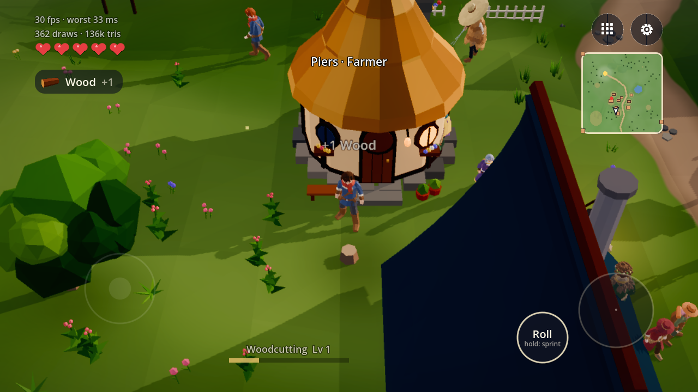
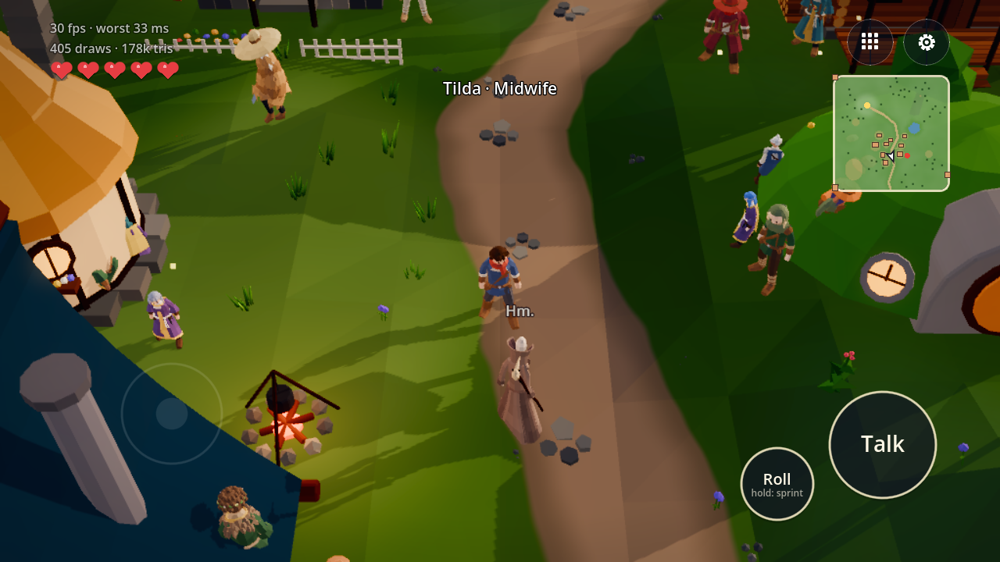
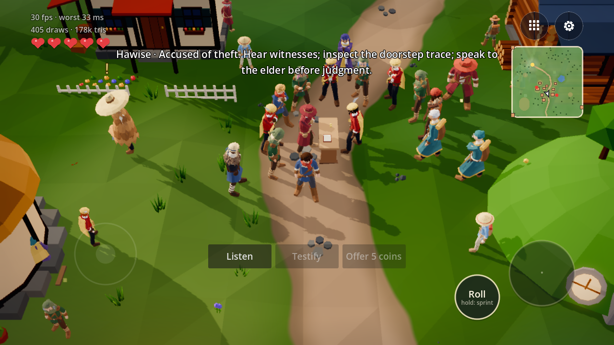
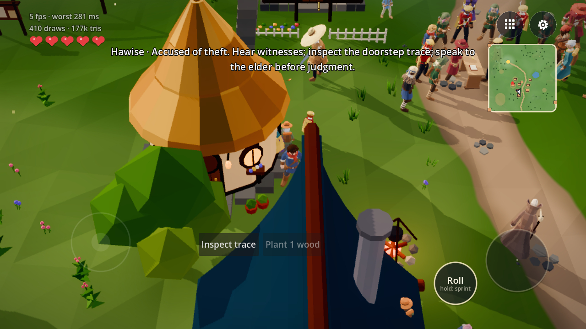
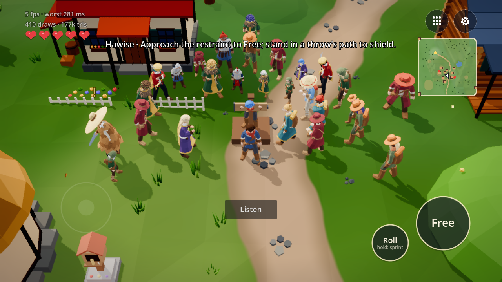
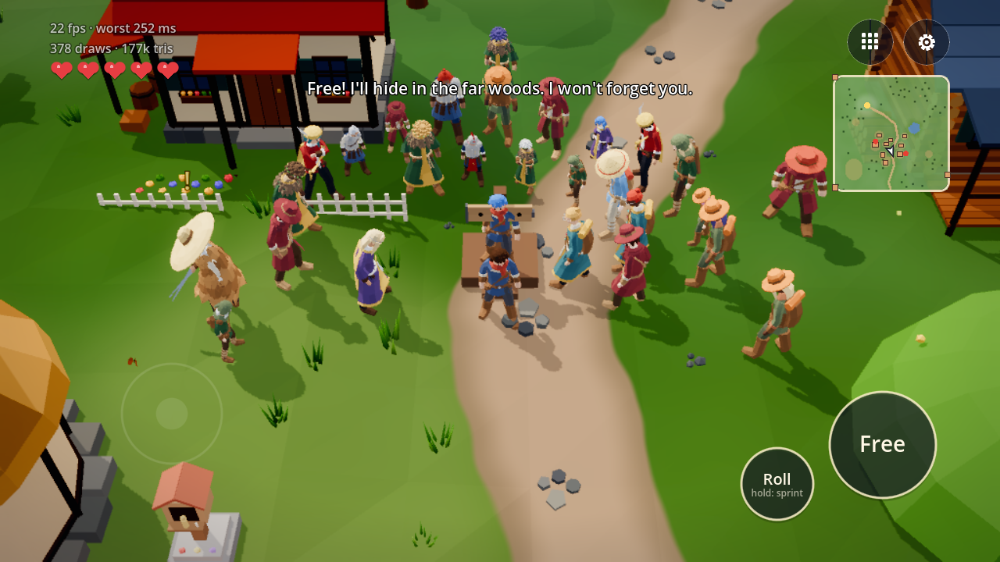
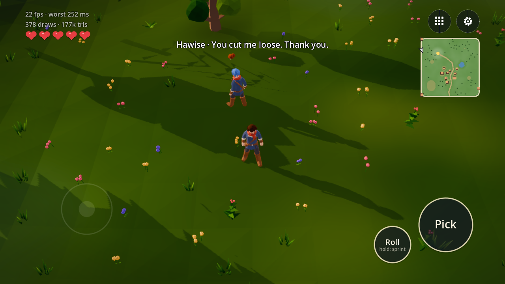
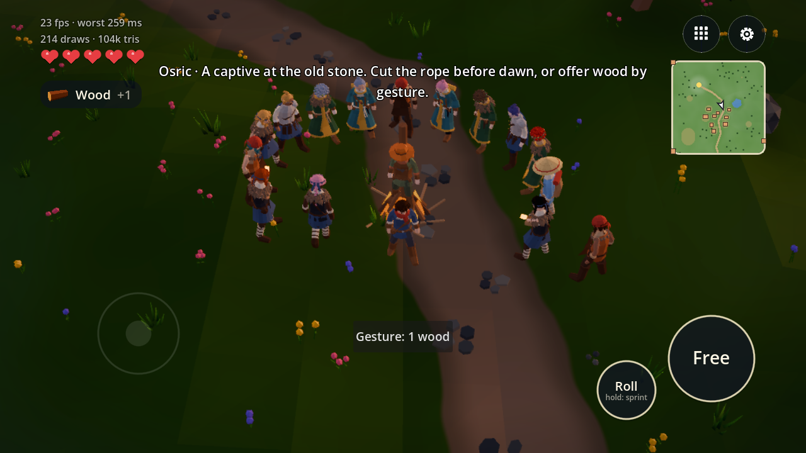
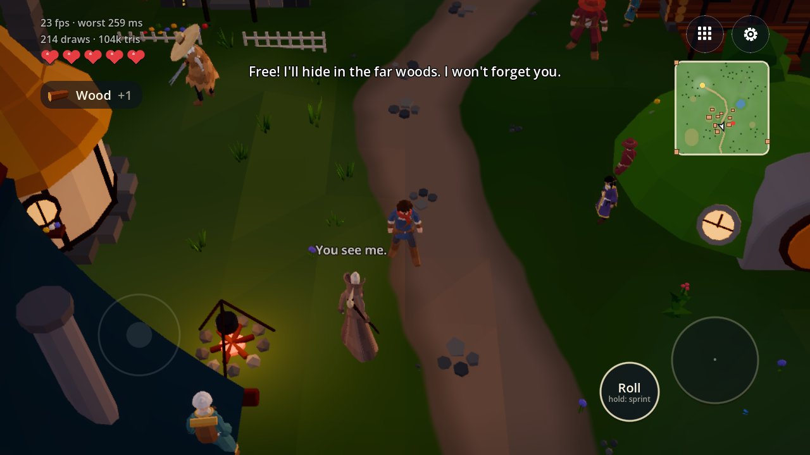

# The same resident before, during and after an intervention

[run] These are native Godot 4.7.2 Compatibility captures from `f4e0e9b`, on an RTX 3050 Laptop GPU, using the real main scene, resident registry and normal player action button. The deterministic capture probe seeks generated events to keep this board short. It is **not a natural-cadence or performance run**; the FPS text includes those seeks and initial construction. The separate S10 run records cadence without seeking.

[run] Exact seed, event ID, logical minute and displayed cue for every image are in [the capture index](../continuation/captures/index.json). [The renderer log](../continuation/captures/rendered.txt) has eight successful image saves and no warnings or errors. These are several fixtures, not an assertion that the theft hearing pictured caused the separate pillory fixture.

## Ordinary residents and accusation

[run] Additional capture from final source `e714c93`, using the existing `--gathertest --shotframe=179` entry point and isolated `--test-save=gather-board-e714`. The real tree becomes a stump, Wood +1 appears, and Woodcutting progress remains visible among the residents. [The log](../continuation/delivery/gather-capture.txt) confirms tree 510 at `(-9.8, 0.9, 26.4)` and one wood in inventory. This helper invokes the existing gatherer; the normal button's gathering path is separately checked in [the twenty-assertion input run](../continuation/delivery/touch-menu-final.txt).

[run] The theft hearing is seed 3, event 18, minute 44,146. Evidence is at the house's accessible doorstep. Hearing outcomes remain undecided until their deadline; inspecting a trace, hearing an original account and returning to the elder can change the result. Repeating an account does not create a second source. Disabled buttons show missing wood/coins or unavailable testimony.

## Public act, accepted action, remembered aftermath

[run] Seed 1, event 2: Free at minute 5,149 is accepted before the deadline at 5,150. The person, receipt, destination and authority grievance commit before the animation. At minute 5,318 the same Hawise thanks the player in the far woods. [The rendered integration check](../continuation/delivery/boundaries-rendered.txt) separately exercises duplicate input, immediate normal disk save/load, midnight, real region replacement and an untouched event's offscreen deadline.

## Forebears and the interruptible rite

[run] Seed 16,838, rite event 0, minute 1,795: this controlled fixture requests a rite through the existing storm rules. No death has happened before its dawn deadline at 1,800. Free preserves Osric when the storm recedes; the old inhabitants return and ancestors withdraw. The actual normal-world kernel trigger, ignored rites, accepted/refused gestures and recession cancellation are covered separately by [action checks](../continuation/final-rules/README.md) and [the added gesture/source check](../continuation/delivery/retell-offer-godot.txt).

[owner] Whether players notice and understand these opportunities at normal speed still needs Hilmi/Enea's feel review. No owner opinion is inferred from these generated captures.
